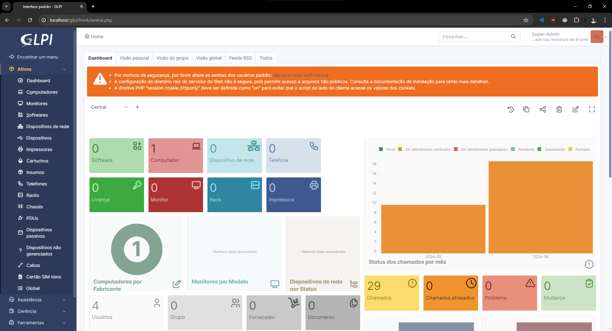
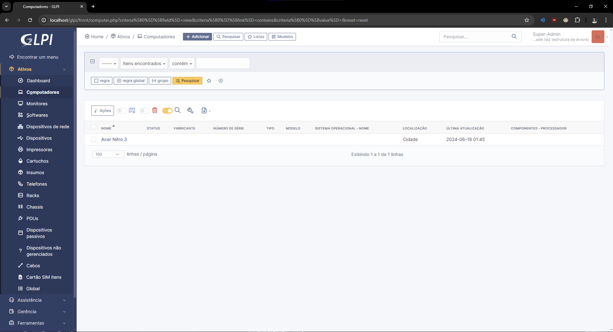
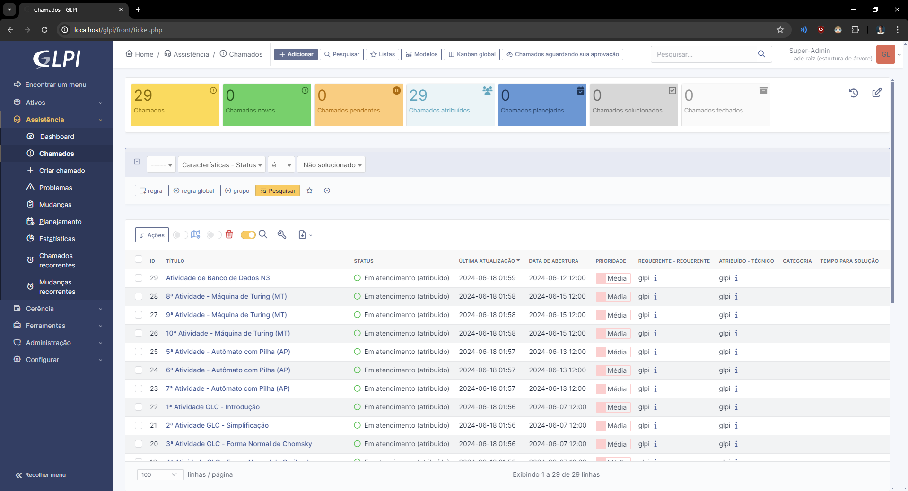
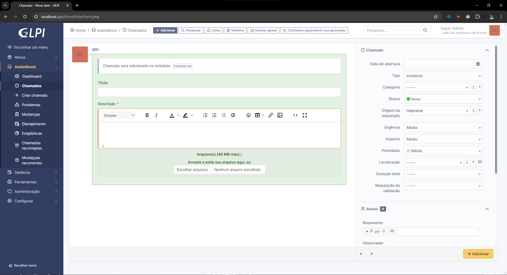

### GLPI

# O que é o GLPI?

[**GLPI**](https://glpi-project.org/) (Gestionnaire Libre de Parc Informatique) é um software de gerenciamento de ativos de TI e helpdesk. Ele permite que as organizações gerenciem seus ativos de hardware e software, acompanhem problemas e solicitações, e otimizem processos de TI.

### Principais Funcionalidades do GLPI

- Gerenciamento de inventário
- Sistema de helpdesk
- Relatórios e análises
- Integração com outros sistemas

### Instalação do GLPI

Passo a passo para instalar o GLPI no seu ambiente. Inclui pré-requisitos, download e configuração inicial.

#### Instalação

- [XAMPP](https://www.apachefriends.org/pt_br/index.html): O XAMPP é uma distribuição do Apache fácil de instalar contendo PHP, MySQL e Perl.

##### Primeiro Passo

Eu utilizei o **XAMPP** para instalar o GLPI. Para começar, faça o download do [XAMPP](https://www.apachefriends.org/pt_br/download.html). 

Após a instalação do XAMPP, baixe a última versão estável do [GLPI](https://glpi-project.org/pt-br/baixar/), que é o GLPI 10.0.15.

##### Segundo Passo

Após baixar o GLPI, extraia a pasta e mova-a para o diretório htdocs dentro da pasta do XAMPP.

##### Terceiro Passo

Os módulos **gd** e **intl**, precisam estar presentes, então edite o `php.ini`  que se encontra em apache/condig para descomentá-los e garantir que estejam habilitados.

Inicie os serviços Apache e MySQL no XAMPP. Em seguida, abra seu navegador e digite `http://localhost/glpi` para acessar a interface principal do GLPI.

#### Configuração Básica do GLPI

Após a instalação, configure o GLPI de acordo com suas necessidades. Defina o idioma padrão e continue com a instalação.

### Gerenciamento de Usuários
Pagina inicial do glpi, aqui voce deve criar um ativo de acordo com sua necessidade, criei o ativo de acer nitro 3 que é o meu computador, preenchendo o formulário ao meu gosto, para indicar que ele vem criar os chamados

### Gerenciamento de Chamados

Em assistencia/chamados, aparecem os chamados e deve ser criado sempre que uma tarefa nova for executada, nesse caso de uso utilizamos para demarcar as atividades de sala

### Chamados registrados

### Tela de criação de chamados

